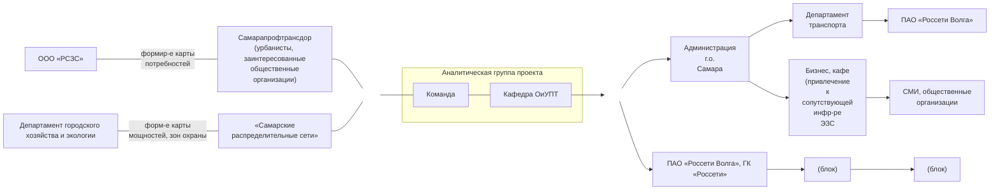

```mermaid
flowchart LR
    F1["ООО «РСЗС»"]
    O1["Самарапрофтрансдор<br/>(урбанисты, заинтересованные<br/>общественные<br/>организации)"]
    F2["Департамент городского хозяйства и экологии"]
    SRS["«Самарские<br/>распределительные сети»"]

    J[" "]

    subgraph CORE["Аналитическая группа проекта"]
        TEAM["Команда"]
        CAREER["Кафедра ОиУПТ"]
        TEAM --- CAREER
    end

    NODE1[" "]
    ADM["Администрация<br/>г.о.<br/>Самара"]
    F3["Департамент<br/>транспорта"]
    EN["ПАО «Россети Волга»"]
    BIZ["Бизнес, кафе<br/>(привлечение<br/>к<br/>сопутствующей<br/>инфр-ре<br/>ЭЗС"]
    SNIP["СМИ, общественные<br/>организации"]
    INV["ПАО «Россети Волга», ГК «Россети»"]
    EMPTY1["(блок)"]
    EMPTY2["(блок)"]

    F1 ---|"формир-е карты<br/>потребностей"| O1 --- J
    F2 ---|"форм-е карты<br/>мощностей, зон охраны"| SRS --- J
    J --- TEAM

    %% Одна линия из кафедры до точки разветвления
    CAREER --> NODE1
    
    %% Разветвление на два блока на одинаковом уровне
    NODE1 --> ADM
    NODE1 --> INV
    
    %% Разветвление от Администрации на две ветки
    ADM --> F3 --> EN
    ADM --> BIZ --> SNIP

    %% Одна линия от Инвесторов
    INV --> EMPTY1 --> EMPTY2

    classDef hidden fill:none,stroke:none;
    J:::hidden;
    NODE1:::hidden;
```
